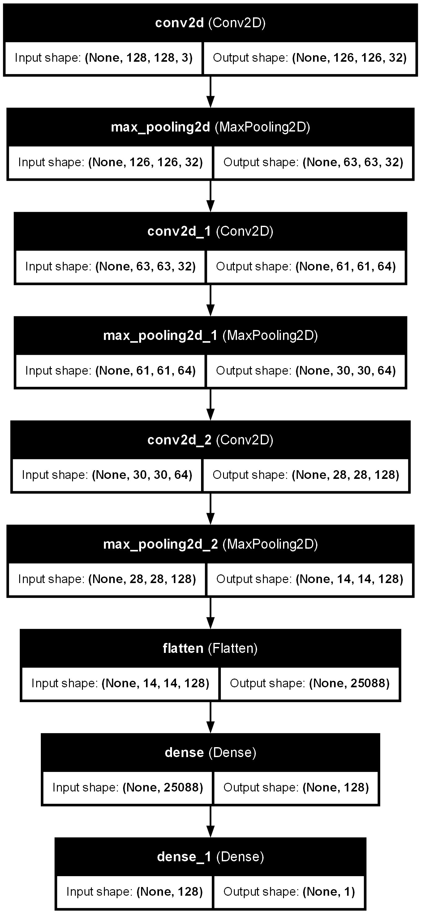
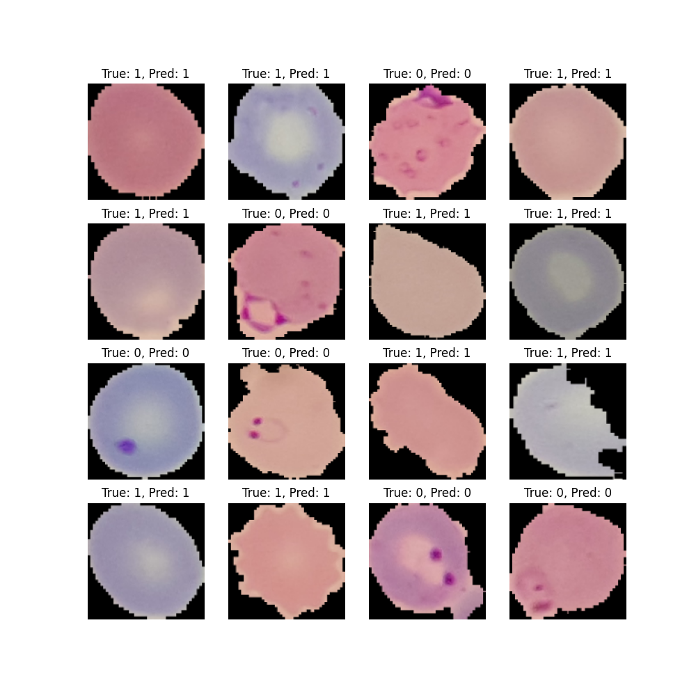

# Malaria Detection using CNNs

## Architecture

The CNN has the following layers:

## Code

The code is divided into file, to load the data, run 'downloadData.py'.  
To train the model, use 'training.py'.  
To visualize the predictions, use 'Test.py'  
To generate the model picture, use 'visualize.py'  

## Demo results

After training, the model has been placed in the MalariaModel.keras file, It has an accuracy of 94%, I visualized some results here:

> 0 means that the cell is infected  
> 1 means that the cell is not infected  

## Dependencies

tensorflow, tensorflow_datasets  
matplotlib (for running 'Test.py'/ generating images)  
graphviz, pydot (for running 'visualize.py'/ generating model architecture picture)

## My Setup

I used a GPU to train the model (nvidia GTX 1060 with 6 GB VRAM)  
I used WSL2 for running the training script as tensorflow GPU is hard to setup on windows.  
The training process took about 322 seconds or 5 minutes and 22 seconds.  
The convergence happened at 3rd epoch with accuracy jumping from 67% to 87% and in 4th epoch it went from 87% to 95%. After that, there were some marginal improvements for 7 generations.
